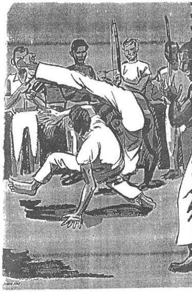

\newpage

# Introducción

Entre los hijos y nietos de esclavos en Brasil es una expresión común
decir que el blanco hace la letra y el negro la treta. La capoeira
cuenta entre sus habilidades la de siempre escapar a los intentos de
quienes pretenden atraparla en libros como este.

Este no es -al menos no pretende serlo- un trabajo de interpretación;
es más bien un vuelo de pájaro muy, muy alejado de la profundidad de
las obras que consultamos. Surgió para llenar dos vacíos: un cancionero
que facilitara el aprendizaje de canciones en una lengua extraña

