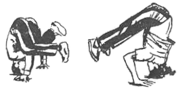

# ¿Roza, jaula o pájaro? El término

*Capoeira pra estrangeiro, meu irmão  
E mato  
Capoeira brasileira, meu compadre  
E de matar*

Ajena a la idea de que el nombre sea arquetipo de la cosa, la capoeira es ambigüa
desde la palabra que la define: es a la vez ave, caponera y roza. ¿Por qué se
llamó así al juego? Depende de qué palabra escojas como origen. El vocablo
portugués 'capoeira', el más antiguo --usado desde 1614-- hace referencia a la
palabra "capão": capón, pollo castrado, en alusión a las jaulas donde se los 
encierra. Según esta versión, el juego habría tomado el nombre "por parecerse tanto
a una pelea de gallos" o por ser en el mercado de aves donde nació, entre los
esclavos que se entretenían con su práctica.

Según otros autores, con base en un concepto netamente brasileño, vendría del tupí
"caa-opuam-era", traducido por "isla de matorrales ya cortada", algo así como la roza,
labor con que se limpia la tierra de maleza para sembrar en ella. Llamar así al juego
haría referencia a que durante la esclavitud sucedía que el amo preguntara al capataz
"¿Dónde está la negrada?" --es decir los esclavos-- y éste respondiera "Allá en la
roza" --es decir "en la capoeira", sin declarar que se la estaba practicando.

Otro significado está asociado con un ave llamada "capoeira" (*Odontophorus capoeira*,
Spix). Se dice que su canto era usado por los cazadores nativos como señal, por lo que
se les llamaba también "capoeiras". El macho de esta ave, muy celoso, lucha fieramente
con sus rivales, otro elemento que según esta teoría la asemeja con los capoeiras.

Hasta el siglo pasado el nombre de "capoeira" era aplicado por los blancos a todo tipo
de lucha de origen africano; de hecho, "cualquier demostración de destreza física",
fuera njinga, n'golo, basula, gabetula, pernada o baruque el nombre dado a las mismas
por quienes las practicaban, recibían el apelativo de capoeira.

