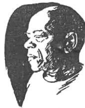
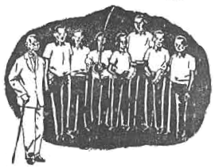

# Historia

## Historia de  Brasil

*Qué navio é  
Que chegou agora  
É o navio negrerio  
Com escravos de Angola.*

Mira el mapa arriba. No hace falta mucha imaginación para suponer que las
costas de África y Brasil son piezas para colocarse juntas en el rompecabezas
del mundo; juntas estuvieron hace millones de años, antes de que hubiese hombres
de ningún color.

Hace como quinientos años, los marineros de un reino llamado Portugal, frontera
occidental de Europa, en busca de nuevas rutas comerciales, habían entrado en
contacto con pueblos africanos de los que obtenían objetos codiciados, como el
marfil, a cambio de sus manufacturas; también obtenían a los prisioneros de las
continuas guerras intertribales, con la intención de hacerlos trabajar para su
beneficio bajo un sistema que llamamos esclavitud y que entonces nada tenía que
ver con la capacidad o la "raza": los árabes hacían esclavos a los europeos; algunos
médicos, músicos o poetas famosos de la antigüedad eran esclavos de sus señores
griegos, egipcios o persas. En abril del año 1500, un marinero portugués, Pedro
Alvares Cabral, dirigiendo una gran flota a la India, fue desviado por los vientos
hasta unas costas en las que lo primero que encontró para explotación comercialmente
fue un árbol de cuya corteza se extraía un tinte rojo muy apreciado por los fabricantes
de telas. Este árbol era llamado Palo Brasil y de ahí tomó nombre el lugar.

Se ha estimado que al llegar los portugueses, Brasil estaba poblado por un millón
de individuos asentados en la franja costera; unos cuantos años después los nativos
habían sido diezmados hasta casi desaparecer y grandes superficies de selva 
completamente taladas; el nuevo negocio era la caña de azúcar, que hasta entonces se
vendía por gramos en las metrópolis europeas. La explotación de la caña de azúcar
requería mucha mano de obra, para lo que se recurrió a los africanos, a quienes se
consideraba poco menos que bestias --no importando que, a diferencia de muchos de
sus amos, algunos supieran leer y escribir y hubieran desarrollado una metalurgia
avanzada. Así comenzaría un sistema que en poco más de trescientos años trasladaría
a América millones de esclavos provenientes del Congo, de Angola, de Benín... seres
con lenguas, religiones y culturas diferentes entre sí, con sólo el color de la piel
en común.

Los navíos salían de Oporto o Maderia cargados de telas, armas o alcohol para cambiarlos
por esclavos en Benin o Guinea, éstos a su vez eran cambiados en Bahía por azúcar, café
o cacao que llevar de vuelta a Europa. Inglaterra sería a la larga uno de los principales
beneficiarios de este comercio triangular.

Las rebeliones se sucedieron una tras otra hasta el "final" de la esclavitud en 1888.
Una es precisamente el escenario de la leyenda más difundida sobre el origen de la
capoeira.

## La leyenda

*Zumbi é nosso herói  
Pela causa do homem negro  
Foi ele quem mais lutou*

En el siglo XVII los holandeses, buscando convertirse en una potencia colonial a
semejanza de sus vecinos europeos, invadieron Pernambuco, en el nordeste de Brasil.
La guerra que sostuvieron con los portugueses desorganizó las "fazendas", las fincas
donde se explotaba la caña de azúcar o el café, permitiendo que muchos esclavos
escaparan a la selva. Algunos se agruparon según sus costumbres tradicionales, formando
aldeas gobernadas por reyes al estilo africano.

Alrededor de 1630 en la región de Alagoas había un reino negro conocido como Quilombo
dos Palmares, que resistió casi sin armas --por lo que la destreza física se hacía
indispensable-- los continuos ataques de los portugueses; hasta el 20 de noviembre de
1695, fecha en que fue asesinado Zumbi, su último cacique, héroe de la lucha contra la
esclavitud en Brasil y, según lo quiere la leyenda, el primer capoeira.

## Los orígenes de la capoeira

*E a lua vem surgindo  
Por de tráz da bananeira  
Não è lua, não è nada  
È a bandiera Brasileira  
No largo do terreiro  
É a roda de capoeira.*

Brasil fue una colonia portuguesa hasta 1822, cuando se convirtió en un reino
independiente. Bajo el gobierno del Emperador Pedro II se decretó la abolición de la
esclavitud --que ya no se consideraba rentable-- el 13 de mayo de 1888. Todos los
documentos relacionados con la trata de negros fueron quemados, por lo que son escasas
las evidencias que tenemos sobre los orígenes de la capoeira anteriores al siglo XIX.

Reportes policiales y notas periodísticas, que registran a "negros chamados capoeiras",
que "vivíam no mato e assaltavam passageiros", les crearon una fama de criminales que se
mantendría hasta hace poco tiempo. Hay también algunos registros pictóricos como los del alemán João Mauricio Rugendas, que permiten suponer la práctica de la capoeira --no como
la conocemos actualmente-- desde antes de 1835.

Sabemos que tuvo algunos episodios importantes en la historia brasileña: en 1811 demostró
su eficiencia como lucha cuando los amotinados mercenarios europeos contratados para la
Guerra de Cisplatina (hoy Uruguay) fueron enfrentados sin armas de fuego por "magotes de
capoeiras"; en 1890 provocó una crisis en el gabinete de 
la recién formada república, al ser desterrado "por capoeira" João Reis, hijo de un 
cierto conde de Matosinhos, dueño de un diario dirigido por el ministro de Relaciones 
Exteriores; y se vistió de una dudosa gloria al ser usados muchos de sus practicantes
como carne de cañón en la Guerra de Paraguay de 1864 a 1870.

En 1890, por considerarla una "enfermedad moral" se establecieron severas sanciones
contra la práctica de la Capoeira. Sin embargo, las primeras propuestas para integrarla
a la sociedad brasileña, convirtiéndola en "gimnástica nacional", emblanquecida, 
institucionalizada y limpia de sus elementos africanos, comienzan en 1893 con
"Capoeiragem e Capoeiras Célebres", un artículo de Mello Moraca Filho, en el que 
afirmaba que la capoeira "como arte, como instrumento de defensa, es la lucha propia
de Brasil". En 1907 un oficial del ejército que prefirió mantener el anonimato firmando
como "O.D.C." publicó "O Guia do capoeira ou Ginástica Brasileira", el primer manual
de capoeira del que se tenga noticia. En 1928, por considerar su práctica excelente para
el desarrollo del cuerpo y los sentidos, el escritor Cohelo Neto sugería hacer
obligatoria su enseñanza "en los colegios, cuarteles y navíos", llegando incluso a
enviar un proyecto de ley en ese sentido a la Cámara de Diputados, buscando mostrar la
superioridad de la capoeira sobre otras artes marciales. Neto hacía referencia a la
victoria en 1910 "mediante un violento 'rabo-de-arraia' del 'negro Ciriaco' sobre 
'Conde Koma', campeón japonés de Jiu-jitsu. Por cierto, se dice que esa ocasión el
capoeirista aprovechó el saludo ritual del oriental para picarle los ojos, tras lo cual
pudo derrotarlo fácilmente; por supuesto ningún brasileño vió algo censurable en esa
demostración de "malicia".

También en 1928 Aníbal Burlamaqui, "mestre Zuma", publicó "Ginástica Nacional 
(Capoeiragem) Metodizada e Regrada", donde propone para la capoeira reglas inspiradas
en el box. Se dice que mestre Bimba tomó de este libro la idea de sistematizar la
capoeira.

Todas estas obras, publicadas en Río de Janeiro, entonces capital de Brasil, comparten
una visión "blanca" y deportiva, de algún modo opuesta a la visión "negra" y de cultura
popular que revolucionaría la capoeira en Salvador a principios de este siglo.

## San Salvador, 1900

*Lá no céu tem três estrelas  
Todas as três em carreirinha  
Uma é Bimba, outra é Besouro  
Outra é Mestre Pastinha...*

A principios de este siglo, tras un largo período de persecuciones, la capoeira casi
había desaparecido del panorama brasileño. En Bahía --"la meca negra de América"--
persistían algunas artes de lucha de tradición africana; una cuyo rito requería el
acompañamiento musical del "berimbau" era llamado "Jogo de Angola"; una mucho más
violenta era llamada "Batuque"; otra que usaba machetes y se acompañaba de tambores
era conocida como "Maculelé"; para la policía, los practicantes de cualquiera de estas
artes podían ser acusados de "capoeiras". Se decía entonces --con negro humor de
capoeirista-- que era mejor hacer las rodas cerca del cuartel para evitar ser llevado
a rastras por la caballería.

En cuanto a estilos, aunque se dice que actualmente hay tantos como buenos maestros,
siempre terminan por remitirnos a las tres mayores estrellas del cielo de la capoeira:
Besouro, el último capoeira místico; Bimba, el gran renovador, y Pastinha, el filósofo.
La leyenda del primero y las acciones e ideas de los otros dos revolucionaron la 
capoeira hasta entonces existente, dándole un lugar dentro de la sociedad brasileña 
--si bien desde posturas distintas-- y ofreciéndole la palanca necesaria para dar "a
volta ao mundo".

## Besouro

*O (ilegible)  
Besouro Macangá  
Bateu foi na sargento  
Da Policia Militar*

Besouro Macangá fue quizá el último de los capoeiristas de leyenda. Su verdadero
nombre era Manuel Henrique, originario de Santo Amaro de Purificação, en Bahía.
Se decía que tenía el "corpo fechado" es decir protegido contra las balas por
un rito de candomblé; además de tener la facultad de desaparecer inexplicablemente,
quizá convertido en un escarabajo volador, como Mackandal el héroe negro de Haití.
Sus hazañas recuerdan las de los orixás, o las descritas por Leo Frobenius en el
"Decamerón Negro". Se dice que su último patrón, cansado de sus correrías y 
aprovechando que no sabía leer lo mandó al Ingenio Maracangalha con una nota para
el dueño pidiendo se diese muerte al portador de la misma. Sabiendo de su
extraordinaria protección, éste lo invitó a pasar la noche en un burdel, pues se
suponía que el contacto con mujeres debilitaba el hechizo: al día siguiente fue
cercado por varios pistoleros que no hubieran podido con él de no haber usado una
"faca de tucum", contra la que nada podía su "corpo fechado". Desde entonces pasó
a vivir en la memoria de todos los capoeiristas que cantan sus hazañas.

## Bimba

*Manoel Dos Reis Machado  
Ele é fenomenal  
Ele é o Mestre Bimba  
Creador do Regional.*

Manoel Dos Reis Machado nació el 23 de noviembre de 1900 en Salvador, Bahía. Su
madre, segura de que daría luz a una niña, apostó el privilegio de ponerle nombre
con la partera, quien decidió apodarlo con la forma popular de llamar al pene de
los niños en Bahía: Bimba, nombre con el que se haría famoso.

Su padre era un destacado practicante de "Batuque", pero la capoeira la aprendió
de los 13 a los 27 años, mientras trabajó como estibador en el puerto, con un
capitán de la Companhía de Navegação Bahiana llamado Bentinho.

Hacia 1930, "angoleiro respetado", abrió una academia de lo que llamó "Lucha
Regional Bahiana", pues para él la capoeira había nacido precisamente en Bahía;
a la vez, el nombre de la escuela lo alejaba de los prejuicios contra la capoeira.
En ella enseñaba una síntesis del "jogo de angola" --que a su parecer "dejaba mucho
que desear" pues "sólo mostraba danzas y acrobacias"-- con algunos movimientos de
"batuque", "maculelé" y otros de su invención, poniendo énfasis en la eficiencia
para el combate "para o fraco se defender do forte" sin abandonar por completo el
rito de la capoeira tradicional, es decir la roda y la música.

Mestre Bimba fue el primero en sistematizar la enseñanza de la capoeira, que hasta
entonces era transmitida de un "iniciado" a un "iniciante", o por imitación en las
rodas públicas. Por contar con un breve espacio de tiempo para enseñar a un gran
número de personas, organizó lo que para él era más importante en una serie de ocho
secuencias de ataques y defensas. Incorporó algunos movimientos con agarres, la
"cintura desprezada", que hasta entonces no existían en la capoeira.

También estableció el primer sistema de graduación; tras los primeros seis meses de
entrenamiento (tres clases semanales de una hora) organizaba una ceremonia llamada
"formatura" en la que entregaba a los alumnos un pañuelo de seda blanco (antecedente
de las actuales "cordas") por la creencia de que las navajas, que antiguamente
salían a relucir a la menor provocación, no cortaban la seda. Los pañuelos eran una
forma de decirle a sus alumnos que los consideraba aptos para enfrentar cualquier
circunstancia en la roda. Tras el blanco de "formado" venían el rojo de 
"especializado" y azul de "contramestre". Es importante mencionar que estos eran
usados sólo el día de la ceremonia.

En su academia sólo aceptaba a gente que demostrara tener un trabajo o estar
estudiando, con lo cual excluía a la mayor parte de la población negra; tenía en
cambio por alumnos a los hijos de los sectores mejor acomodados de la sociedad,
que hasta entonces sólo habían visto en la capoeira una "enfermedad moral" "terror
de la población pacífica".

Desde la aparición de la capoeira regional, se acusó a Bimba de introducir elementos
ajenos a la cultura africana, de "emblanquecer" la capoeira, de alejarla del suelo
para complacer a sus clientes acomodados, llegando incluso a negarle cualquier
relación con la "legítima capoeira", "legado de Angola". Sin embargo, su estilo
--que ofrecía un cierto grado de domesticación, que tranquilizaba a las autoridades,
sin perder del todo los elementos folclóricos que tanto comenzaron a interesar a
los órganos de turismo-- ganó rápidamente adeptos por todo el país. Sus innovaciones
dieron efectivamente pie a la aparición de interpretaciones muy poco ortodoxas de la
capoeira, pero también le ofrecieron la frescura y el aliento necesarios para
convertirla en deporte nacional brasileño. Atractiva y fácil de entender, ha abierto
las puertas a un gran número de personas que después de conocerla pueden incluso
sentirse más identificadas con la postura de la capoeira angola.

Tras una vida dedicada a la capoeira murió el 5 de febrero de 1974 en Goiânia, a
donde se había mudado en busca de mejor fortuna.

## Pastinha

*Seu Pastinha falou para Bimba  
E agora  
Si você é Regional mestre Bimba  
Eu sou Angola*

Mestre Pastinha, un mulato delgado y de pequeña estatura, "marinero, poeta, pescador,
músico, filósofo y capoeirista", hijo de un español y una africana, iniciado en la
"mandinga de Angola" por un africano llamado Benedito, sería el símbolo de quienes
no se identificaban con el ímpetu renovador de Mestre Bimba.

Nació el 5 de abril de 1889, en Salvador, un año después de la "abolición" de la
esclavitud. Él mismo cuenta que aprendió la capoeira cuando un "Viejo Africano",
apenado de ver que siempre lo golpeaba otro muchacho, lo llamó y le dijo: "Usted
no puede con él, sabe, porque él es mayor y tiene más edad. El tiempo que pierde
jugando raya, venga aquí a mi jacal, que le voy a enseñar algo muy valioso...".

A los 12 años entró a la Escuela de Aprendices de la Marina, donde comenzó su larga
carrera de Mestre de capoeira, enseñando primero a sus compañeros y más tarde a
artesanos y estudiantes. A los 20 años, "cuando su arte no daba suficiente", vivía
de pintar cuadros y de ocasionales trabajos como carpintero, jornalero e incluso de
cuidador de una casa de juegos. Varios investigadores coinciden en señalar que el
apelativo "de Angola" comenzó a ser usado en los años 30 para diferenciarla del
estilo de Mestre Bimba. Sin embargo, los "angoleros" afirman que se debe a que el
origen del juego está en el "N'golo", un supuesto "Baile de la Cebra" practicado en
África, que marca el paso ritual de los adolescentes a la edad adulta, con una lucha
en la que el vencedor puede escoger a la que será su mujer. El mismo Pastinha pudo
comprobar en 1966, cuando viajó al I Festival de Artes Negras de Dakar, Senegal, que
no quedaban rastros, en el caso de que hubiera realmente existido, de una Capoeira
Africana.

En 1941 "a petición de otros Mestres" como Aberré y Amorzinho, abrió el "Centro
Esportivo de Capoeira Angola" en el Largo do Pelourinho, a unas cuantas calles de
la Academia de Bimba, al que reconocía como un capoeirista "de grandes méritos",
aunque consideraba sus innovaciones innecesarias, "no pasando de ser --la capoeira
regional-- una modalidad mixta de lucha o defensa personal donde se encuentran
golpes y contragolpes de todos los métodos de lucha conocidos".

La capoeira angola desdeña los alardes de fuerza y velocidad: su fundamento es la
"malicia", un concepto complejo que tiene que ver con la habilidad para tornar a
nuestro favor las peores situaciones.

Tras treinta años de funcionamiento, en 1971, para una supuesta remodelación del
predio, fue cerrada por las autoridades la academia de Mestre Pastinha, que ciego
y sin condiciones para dar clases por su cuenta, obtuvo al año siguiente una pensión
vitalicia --un salario mínimo-- otorgada por el gobierno de Bahía.

En 1979, gracias al apoyo de amigos influyentes, como el escritor Jorge Amado, se
reabrió la academia en la calle Gregório de Matos, donde las clases eran impartidas
por los mestres João Pequeno y João Grande; se dice que Mestre Pastinha corregía a
los nuevos alumnos "por el sonido de la caída en el tablado". Ese mismo año sufrió
un derrame cerebral y al siguiente fué internado en el Asilo Don Pedro II, donde
murió, el 14 de octubre de 1981.

## Capoeira en México

*Aprendí a capoeira  
Angola e Regional  
É depois vine pra México  
Para poder ensinhar.*

El primer profesor de capoeira instalado permanentemente en la Ciudad de México fue
el argentino Mariano Andrade, que fue alumno de Yoshi Senna en la Universidad de
Buenos Aires.

Mariano comenzó a dar clases en 1992, con un taller auspiciado por la UNAM en el
Antiguo Colegio de San Idelfonso. En el verano de ese año --era yo entonces un
alumno iniciante-- realizamos un viaje por la peninsula de Baja California dando
exhibiciones por donde íbamos pasando de camino a San Francisco, donde participamos
en el First National Capoeira Encounter.

En 1994, invitado por una compañía de danza, Mariano dio un taller en Punto en el
Espacio, cuya culminación, el primer "Batizado" realizado en nuestro país, contó
con la inesperada y afortunada presencia de Mestre Delei, quien se encontraba de
camino a los Estados Unidos, donde formaría Capoeira Abolição, grupo que dirige
actualmente.

También en 1994 pasó por nuestro país Armando Pequeno, bailarín bahiano radicado en
París, donde entrenaba capoeira con Mestre Beija-Flor. Armando Pequeno dio talleres
de capoeira, organizados por la Coordinación Nacional de Danza, en Xalapa, Veracruz,
y en la Ciudad de México.

En 1995 se formó Ollin-Bao, un grupo formado por músicos y bailarines dedicado a la
difusión de las expresiones africanas en América. Dirigido por Mariano Andrade en la
parte musical, el grupo integró rodas de capoeira a su repertorio hasta su disolución
en 1996.

En 1997 se fundó Banda do Saci, grupo que hasta la fecha dirige Mariano Andrade y que
desde diciembre de ese mismo año, tras la visita de Mestre Curió, practica sólo
capoeira angola.

En junio de 1998 algunas personas interesadas en practicar capoeira sin etiquetas,
formamos Capoeira Longe do Mar. En agosto de ese año se formó en Xalapa el grupo
Cativeiro, dirigido por instructor Japão.

Durante 1999 se establecieron en la Ciudad de México los grupos Cumbé y Abolição,
este último bajo la dirección de Mestre Valinho. En diciembre de ese mismo año se
realizó el Primer Encuentro Nacional de Capoeira en la ciudad de Guadalajara,
organizado por el grupo Terreiro do Brasil, dirigido por el Monitor Tequila. Contó
con la asistencia de más de 60 personas de las ciudades de Ensenada, Guadalajara,
León, Querétaro, Xalapa y el Distrito Federal; además, sabemos de la existencia de
grupos en Mérida, Los Mochis, Puerto Escondido y San Cristóbal de las Casas.

Actualmente se está organizando la Asociación Mexicana de Grupos de Capoeira.
\newpage
