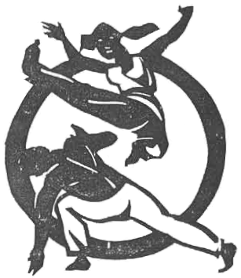

# Capoeira angola y regional

*"Mestre Bimba - Velho capoeirista  
Bahiano, de grandes méritos, practica  
en su academia a Capoeira  
Regional."*  
-- Mestre Pastinha

En 1937 en la ciudad de San Salvador, en el estado brasileño de Bahía, Mestre
Bimba abrió la primera academia oficial de Capoeira con el nombre de "Centro
de Cultura Física e Capoeira Regional". En una época en que este arte era
perseguido por la ley, Mestre Bimba tuvo la brillante idea de darle a la
capoeira una forma deportiva más similar a la de otras artes marciales que ya
eran conocidas y aceptadas en Brasil, como el box, el jiu jitsu y la lucha
libre, amén de querer recuperar la efectividad combativa del arte, algo que
con la pesada persecución policial se había ido mermando.

Aprovechando su gran destreza como angolero y su conocimiento del batuque (un
antiguo arte marical africano que heredó de su padre) desarrolló un nuevo
sistema al que dio el nombre de "capoeira regional". También se dice que
tomó golpes y movimientos de otras formas de lucha, aunque sobre esto existe
cierto desacuerdo y todavía es tema de discusión.

Después de ver una exhibición de capoeira regional con Mestre Bimba, el
presidente Getulio Vargas declaró a la capoeira "deporte nacional brasileño",
con lo que esta disciplina salió de la ilegalidad y actualmente es el segundo
deporte más practicado en ese país (adivina cuál es el primero). Pero la
capoeira ya se enseñaba clandestinamente en Rio de Janeiro, San Salvador y
Recife desde mucho antes de su legalización, y según varios autores esta
enseñanza ya comenzaba a tener un carácter académico e incluía personas de
todas las clases sociales.

La capoeira regional no gustó a todo mundo, sobretodo a quienes les importaba
la "pureza cultural" del jogo de capoeira. Estas personas se declararon
defensores de una capoeira más africana y le llamaron capoeira de angola. La
persona más importante dentro de este grupo y que se convirtió en un símbolo
de esta forma de resistencia cultural fue Mestre Pastinha, para quien "o nome
de capoeira angola é consequencia de terem sido os escravos Angolanos, ná
Bahia, os que mais se destacaram na sua practica". Desde entonces la discusión
sobre cuál de las dos es más legítima, bella, efectiva y demás, no ha parado
e incluso ha llegado a adquirir tonos agresivos y deslegitimadores para ambas
partes. Con el tiempo cada vez más gente reconoce que se trata de dos estilos
diferentes, que no hace falta poner a competir a ambos, herederos de las mismas
raíces aunque uno haya optado por el camino de conservar una tradición y su
pureza, y el otro por el de la innovación y la constante renovación.

Dentro del estilo angola existen muchas convenciones y gestos de gran contenido
simbólico y de distintos significados que no se usan en regional, como es el
caso de las chamadas o passagems: momentos en el jogo de Angola en los que con
un gesto se invita al contrincante a aproximarse y que pueden representar desde 
una cortesía hasta un reto. De éstos, que son bastante variados entre los
angoleros, la capoeira regional sólo conserva la invitación a caminar en círculo
dentro de la roda para descansar, y la llamada al pie del berimbau.

*Iñaki Garrido*

\newpage
