# Jogo bonito

## La batería de capoeira

La batería tradicional de la capoeira, como era enseñada por Mestre Pastinha,
está formada por tres berimbaus y caxixis, dos panderos, agogó, reco-reco y
atabaque. Muy poco se sabe acerca de cómo llegó a conformarse de esta manera;
incluso el berimbau, "dueño absoluto del ritual de la capoeira" y que hoy es
su símbolo inconfundible, se supone de asociación reciente con el rito,
alrededor de 1880. El número y el orden en que son colocados los instrumentos
varía de un grupo a otro.

### Agogo

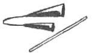

Instrumento de percusión africano, compuesto por dos campanas de fierro.
Significa "campana" en nagó, del que pasó al portugués sin modificaciones.
Rego lo registra sólo en las academias de Pastinha y Canjiquinha.

### Atabaque

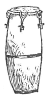

Término de origen árabe (de "tabl", "tímpano moro", Diez), se le halla presente
en la poética medieval. Instrumento antiguo entre los persas y los árabes, aunque
divulgado en África, de donde serían originarias algunas especies. En Brasil
habría llegado con los portugueses para ser usado en sus fiestas y procesiones.
Hay quien afirma que sólo se asoció a la capoeira hasta los años 50. Rego registra
que no era más usado en la capoeira cuando escribió su libro (1968).

### Berimbau

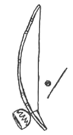

Es actualmente el principal instrumento de la capoeira, a la que se habría asociado
a fines del siglo pasado. Se supone que habría tomado el nombre de un instrumento
tocado con la boca, introducido a Brasil por los portugueses. Se han sugerido el
mandinga "bilimbano" y el quimbundo "mbirimbau" como otras posibles fuentes del
nombre. Se le conoce además como urucango, gobo, marimbau y gunga, entre otros
términos. A Brasil fue introducido por los esclavos africanos que lo usaban para
llamar la atención a sus mercaderías y para pedir limosna. En una batería
tradicional son tocados tres berimbaus que toman nombres diferentes según su
afinación relativa. Al más grave se le llama "gunga" --su nombre africano según
algunos maestros-- y al más agudo "viola", conservando el tercero el nombre de
berimbau, aunque hay quien le llama "meio". Una teoría muy interesante sugiere
que la asociación del berimbau con el rito puede haber salvado a ambos de la
desaparición, pues al terminar la represión hacia la capoeira ésta prácticamente
desapareció, sobreviviendo únicamente en Bahía, único lugar donde su práctica
exigía la presencia del instrumento, que a su vez había dejado de tener cualquier
otro uso.

### Caxixi

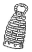

Nada en concreto se sabe acerca del origen de esta pequeña canasta rellena de
semillas que se usa exclusivamente en la capoeira, como complemento del berimbau.

### Pandero

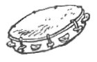

Poco se sabe del origen del término. Se le coloca entre los antiquísimos instrumentos
usados por los hindúes. En la edad media fue introducido a la península ibérica y
de ahí pasó a Brasil donde se le menciona ya en 1549, desde entonces ha sido
aculturado y aprovechado por los negros. Hoy es el símbolo de la samba.

### Reco-reco

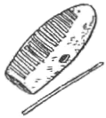

También conocido como ganza en Brasil o como güiro en México y las Antillas. Se
desconoce su procedencia, así como el origen del nombre.

## Los toques

*Na roda da capoeira  
O berimbau é o melhor  
Camará!*

El berimbau dirige la roda de diferentes maneras; los jogadores han de seguir el
ritmo que les marca y atender sus llamados, pero también hacer el tipo de juego
que el berimbau indica. Jugar "angola" o "regional" cuando el toque así lo requiera.
Mestre Bimba modificó la forma tradicional de tocar São Bento Grande para adaptarlo
a las necesidades de su nuevo estilo: tambien inventó Iuna para hacer jugar a
sus alumnos graduados. Cavalería avisaba sobre la proximidad de la policía montada,
recuerdo de la persecución contra la capoeira.

En las rodas en que se usan tres berimbaus la noción de los toques se complica,
pues, según lo sugiere Mestre Moraes, pasa a referirse a una armonía, en la que
cada berimbau cumple su propio papel. A continuación reproducimos algunos toques
según la noción propuesta por Kay Shaffer

---

>### Notación
>
>
>Nota más aguda. Tocada con la piedra apretada contra el alambre.
>
>
>Nota más grave. Alambre suelto.
>
> 
>Caxixi solo.
>
>
>Alambre golpeado con la baqueta cuando la piedra está tocando el alambre ligeramente.
>
>
>Piedra apretada contra el alambre, produciendo una nota aguda, pero sin golpear con
>la baqueta.
>
>
>Símbolo para el movimiento de la calabaza de una posición contra la barriga a una
>posición un poquito distante, produciendo el efecto "wah-wah".
>
>
>Abierto. Tocado con la calabaza a distancia de la barriga.
>
>
>Cerrado. Tocado con la calabaza contra la barriga.
>
>Generalmente cuando se toca una nota grave, la calabaza se acerca más a la barriga,
>y cuando se toca una nota aguda, la calabaza tiene un poquito de distancia.
>
>También cuando se toca una nota grave, siempre se golpea el alambre abajo del lugar
>de la piedra, y cuando se toca una nota aguda, se golpea siempre arriba de la piedra.

---

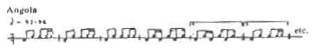

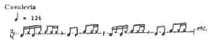

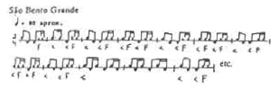

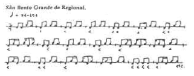

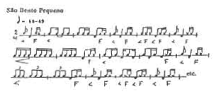

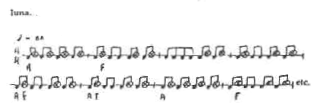

## La roda

*Berimbau tá chamando  
Olha a roda formando  
Vai se benzendo prá entrar  
O toque é de Angola  
São Bento Pequeno  
Cavalaria e Iuna...*

Antes de que existieran las academias, la roda era el centro, el "terreiro", la
escuela, el punto de encuentro y el máximo tribunal del universo capoeirístico.
Cuando su práctica era prohibida, cada roda de capoeira era un espacio ganado
a los amos, con sus propias reglas y convenciones.

Actualmente, con la capoeira parcialmente domesticada y encerrada entre las cuatro
paredes de una academia en la que la metodología puede tirar hacia el karate, el
yoga, la gimnasia o la mística, la roda debe ser el principal suceso, la chispa
que ayude a mantener viva la llama de la capoeira.

Una roda de capoeira regional puede realizarse con apenas un berimbau y casi sin
otra ceremonia que la de entrar al pie de la batería. Vamos por lo tanto a intentar
describir el más elaborado ritual de una roda de capoeira angola. El berimbau más
grave comienza tocando "Angola", el medio toca "São Bento Grande" y el más agudo
toca "São Bento Pequeno", o según otros maestros improvisa. Aquí se integran los
panderos. Alguien canta una "Ladaínha", en cuanto esta termina y comienza el
"Chula" se integra el resto de la batería, agogó, reco-reco y atabaque, las palmas
y el coro.

Dos capoeiristas pueden pasar a saludar a los instrumentos y acuclillarse "al pie
del berimbau", pero han de esperar que comiencen los "corridos" o que el berimbau
les indique que pueden pasar a jugar. El juego se prolonga hasta que el berimbau
más grave "los llama", entonces han de regresar al pie de éste para darse la mano
y salir, dejando que otros capoeiristas pasen al centro de la roda.

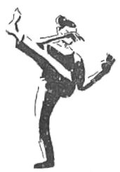

En la capoeira angola los "jogadores" entran siempre de dos en dos, a menos que
esté permitido "comprar jogo", es decir interrumpir una persona el juego de
otras dos. Esto sucede más comunmente en las rodas de capoeira regional.

La roda misma es el mejor lugar para ir aprendiendo las convenciones, y las reglas
indescriptibles, sin embargo hay cosas que es bueno saber antes de tratar de
meterse en una:

Una roda puede parecer alegre y sin riesgos, pero debes tener en mente que la
capoeira es, antes que nada, según Pastinha, "una lucha violenta", debes tener
mucho cuidado al entrar a una roda que no es la de tu academia, mira un rato
los "jogos" y, si consideras prudente entrar, pide primero permiso al mestre
o responsable.

Demuestra que sabes respondiendo los coros y si es posible --no en todos los
grupos permiten que un extraño lo haga-- tocando algún instrumento; pero si
alguien te pregunta sé humilde, de capoeira siempre se sabe solo un poco.

Sé precavido, no puedes confiar en que serás tratado como alguien de la casa.
No muestres de entrada tu mejor "jogo", tu mejor carta debe ser la sorpresa.

Decir que los jogos de angola son "lentos y bajos", mientras que los de regional
son "altos y rápidos" es simplificar demasiado las cosas, hay diferencias radicales
de lenguaje y estrategia entre los dos estilos; aprender bien cualquiera de los
dos puede tomar toda la vida, sin embargo, nada impide que una persona dedicada
llegue a ser un buen practicante de ambas.

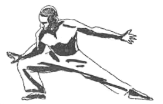

## Chamadas

En las rodas de capoeira angola puede suceder que uno de los jogadores rompa el
ritmo del jogo quedando estático frente a su oponente con la mano extendida, o
de espaldas con los brazos en cruz, o en otra posición extraña, el otro se
aproxima lentamente haciendo fintas y floreos hasta quedar a su lado; comienzan
entonces un extraño baile, unos pasos para adelante, otros para atrás, hasta
que alguno de los dos sale y el juego retoma su curso normal, sin que 
aparentemente haya pasado nada... Son las "chamadas" o "passagem", una de las
situaciones más difíciles de explicar en la capoeira por su ambigüedad y
variedad de significados: recurso para invertir un juego desfavorable, disculpa,
reto, o simple necesidad de tomar un descanso, son siempre una puerta abierta a
la mandinga. Quizá por su complejidad fueron suprimidas de la capoeira regional,
donde usarlas puede ser tomado por una abierta provocación, excepto la "volta
ao mundo" en la que ambos capoeiristas caminan dentro de la roda en dirección
contraria a las manecillas del reloj, con el corazón hacia el centro, o la
llamada al pie del berimbau, para salir de la roda o reiniciar el jogo, esperando
contar con mejor fortuna.

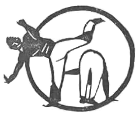

## Batizados

Se dice que cuando la capoeira era una actividad prohibida no se podía usar el
nombre propio; se usaban "nomes de guerra" ganados en la roda por los atributos
o las habilidades. Cuando llegaba un muchacho nuevo a su academia, Mestre Bimba
le echaba un vistazo y le daba algún apodo: llamaban a esto "batizado" (bautizo).
Con el tiempo se fue mezclando con la ceremonia de "formatura", llegando incluso
a sustituírla al cambiar los pañuelos por cuerdas como las de las artes marciales
orientales.

Actualmente los batizados son ceremonias en las que los alumnos pasan a jogar con
un capoeirista más experimentado que los derrumba y a veces les pone un "nome",
tras lo cual una madrina les da la cuerda que les corresponde. Usualmente se
acompañan de exhibiciones de Maculelé, Puxada de rede y batucadas, parte del
folclore de Bahía.

## Sistemas de graduación

No existe uniformidad en cuanto a los sistemas de graduación en la capoeira.
Algunos ejemplos:

Algunos grupos usan los colores de la bandera brasileña y sus combinaciones. El
grupo Abolição utiliza en orden ascendente: cuerda sin color (iniciante), verde,
amarillo, azul, verde-amarillo, amarillo-azul, verde-amarillo-azul (alumno
formado), rojo, rojo-negro, negro (mestre) y blanco (gran mestre).

Otros grupos utilizan los colores de los orixás del candomblé. El grupo Cativeiro
en los ochenta usaba en orden ascendente: verde (Oxóssi), marrón (Omolu),
amarillo (Oxum), morado (Xangó), azul (Iemanjá), rojo (Ogum) y blanco (Oxalá).

Algunas graduaciones se refieren al proceso de liberación del negro y no usan
cuerdas de colores. El grupo Capitães de Areia a principios de los ochenta usaba
en orden ascendente: soga (esclavo), cuerda (quilombola), pañuelo de seda (liberto)
y pedazos de las tres (capitão de areia).

La mayoria de las academias de capoeira angola no usa cuerdas, aunque sí reconocen
grados. ECAIG utiliza: alumno, profesional, treinador (entrenador), contramestre
y mestre. Sólo a partir del grado de contramestre se utiliza un distintivo,
pantalón amarillo con franja negra, contra el pantalón negro con franja amarilla
del uniforme normal.

En la mayoría de las academias un alumno no puede "comprar jogo" sacando de la
roda a otro con una cuerda de mayor grado, una especie de "cromatocracia" bastante
complicada teniendo en cuenta las enormes diferencias entre los sistemas.

## Uniformes

Antiguamente, cuando los esclavos no eran dueños ni de la ropa que usaban, decidir
cuál era la mejor forma de vestirse para jogar capoeira no era un problema. En
los días de trabajo se usaba el "abadá", el pantalón hecho de sacos de azúcar, y
en los días de fiesta la mejor ropa dominguera.

Con la legalización vino la explotación de los órganos de turismo, que pedían
para las exhibiciones pagadas vestuarios vistosos y uniformizados. Se dice que
mestre Pastinha escogió para su academia el uniforme amarillo y negro de su
equipo favorito de futbol, el Ypiranga. Los angoleros, en su mayoría negros de
escasos recursos, exigían el uso de zapatos y camisa como una manera de dignificar
la capoeira; los alumnos de Bimba, en cambio, mejor acomodados económicamente,
no temían ninguna discriminación por entrenar o dar exhibiciones descalzos y con
el pecho desnudo.

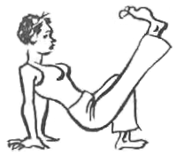

\newpage
