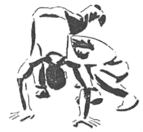

# Canciones de Capoeira

*De donde vengo decimos que el ritmo  
es el alma de la vida, porque el universo  
entero gira en torno a él, y cuando  
nos salimos del ritmo, es que estamos  
en problemas."*

Babatunde Olatunji

Las canciones hacen de la capoeira un arte distinto, le dan un marco que alberga
cada encuentro, haciendo partícipe a todos los miembros de la roda en cada jogo;
mantienen la alegría y producen "axé".

El pequeño cancionero que verás no pretende abarcarlas todas. Existen miles y,
además, miles de versiones de las que aquí están escritas. Estas son sólo algunas
que cantamos frecuentemente y de las que nos sabemos la melodía. No es sencillo
el problema de la ortografía, debido a la gran variedad de palabras de otras
lenguas como el yoruba, el rupi o el nagó; incluso los autores de lengua
portuguesa, como Waldeloir Rego, a veces se inclinan por una transcripción 
fonética. Nos apegaremos a la transcripción de nuestras fuentes y, en caso de
que no existan, trataremos de respetar la ortografía culta portuguesa cuando
la palabra así lo permita (y la sepamos). Al final de cada canción mencionamos
el autor si nos es conocido.

Aunque las clasificaciones --y menos en capoeira-- nunca son una verdad absoluta,
hemos separado las canciones en ladaínhas, chula y cantigas.

La música es una parte esencial del jogo. Un capoeirista es dueño no sólo de su
cuerpo, sino también de su propia voz, pues como dice Mestre Moraes "... una
energía tiene que salir del jogo, y esto comienza en el berimbau, el ritmo y el
canto".

\newpage
